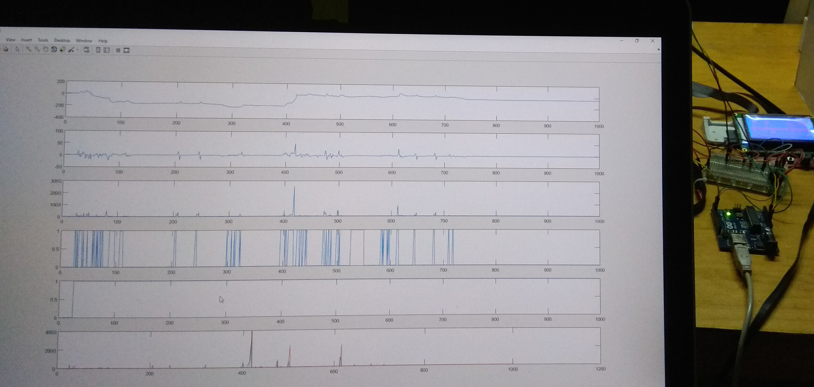

# Smart Strain Gauge Sensor

Use a Strain Gauge + HX711 Load Cell Amplifier as bed leveling sensor for any 3D Printer.

## Description

This has the following benefits:

- No sensor-nozzle relative position calibration needed.
- Excellent precision and repeatability (even if the assembly moves or twists), as the tip itself is used for measuring.
- No added weight to the carriage which reduces inertia.

## Contents

### Analysis

Contains scripts that were used to model the behavior of the gauges under several scenarios of linear movement, acceleration, and bed touching.

### Firmware

This directory contains the following subdirectories:

- examples - snippets and libs that can be used to test the parts
- fw - the functional firmware for the SSGS can be found here along with debugging scripts
- myLibs - experimental variations and tweaks of the public libraries

### Hardware

Design of a small PCB containing a MCU + HX711 Load Cell Amplifier in a Full-Bridge configuration.

## Detailed description

The strain gauge is able to measure extremely small variations in the size of the object it is attached to.

A simple threshold-based triggering of the sensor is not sufficient for providing a reliable method that works universally for several reasons:
- Each assembly will have different physical conditions and constants obviously can't be shared amongst different 3D Printers, requiring each one to be calibrated separately.
- Even for a single 3D Printer, many components create tension in different directions as the nozzle travels to different locations in the bed. The bowden tubes have been found to be a major source of varying forces in the nozzle holder.

Therefore, the derivative and integral components of the signal are used to trigger a touch signal. This allows for the natural deformation that the parts experience as they move to be filtered out from bed touching events.

## Results

The result is a sensor that has an excellent exactness, on par with some of the best alternatives, but with interesting advantages mentioned above.

It has successfully been used in a custom-built 3D Printer which has a large, very uneven, print bed. Here is the 3D visualization of the calibration results using the SSGS as bed leveling sensor.

And the successful first layer printed afterwards.

## Version History

* 0.1 2017-July-23
    * First working POC
    * Successfully integrated and working in Marlin
    * Demo video and prints recorded

## Acknowledgments

Inspiration, code snippets, etc.
* [sparkfun](https://www.sparkfun.com/products/13879)
* [ivanovp/blue_flash](https://github.com/ivanovp/blue_flash/blob/master/hardware/Vcc-gnd.com-STM32F103C8-schematic.pdf)
